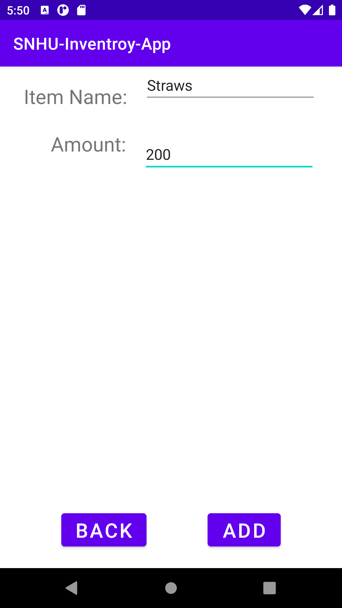

# Android-Inventory-Application-CS360
> An Inventory application made with Android Studio

## Table of Contents
* [General Info](#general-information)
* [Technologies Used](#technologies-used)
* [Features](#features)
* [Screenshots](#screenshots)
* [Project Status](#project-status)
* [Room for Improvement](#room-for-improvement)
* [Contact](#contact)
* [Course Requirements](#course-requirements)

## General Information
> This application was designed to help small business track inventory.

## Technologies Used
- Android Studio
- Java

## Features
List the ready features here:
- Locally Login/Register
- Add New Items
- Send/Receive SMS
- Update Inventory
- Track Inventory

## Screenshots

## Project Status
Project is: _in progress_

## Room for Improvement
Include areas you believe need improvement / could be improved. Also add TODOs for future development.

To Do:
- SMS notification
- Update design constraints
- Additional comments

Room for improvement:
- Clean up the UI
- Allow for cloud saving

## Contact
Created by [@Sergio](https://www.linkedin.com/in/sergio-passos-809aa114a/) - feel free to contact me!

## Course Requirements
- Briefly summarize the requirements and goals of the app you developed. What user needs was this app designed to address?
> The client wanted an inventory application for tracking and updating items. Additionally, users can locally register and have unique items on their account. Lastly, the app can send SMS notifications so that the user can keep up to date on stock.
- What screens and features were necessary to support user needs and produce a user-centered UI for the app? How did your UI designs keep users in mind? Why were your designs successful?
> Three screens were needed in order to accomplish the inventory application. A login/register screen, inventory screen, and adding a new item screen. I wanted the user to have as few screens as possible, while still being a functional application. To know if my designs would be successful I would need to test the application and get user feedback.
- How did you approach the process of coding your app? What techniques or strategies did you use? How could those be applied in the future?
> Modularizing code is the best approach. This takes additional time and effort to accomplish; however, this makes the application scalable and easy to maintain. This should be applied to almost all coding projects. Modularization is one of the best ways in delivering a functional app experience.
- How did you test to ensure your code was functional? Why is this process important and what did it reveal?
> In order to keep the app as functional as possible I manually tested all the features to the best of my ability. Realistically, I would also develop unit tests to ensure that any future changes that unintentionally affect features would be caught before pushing the update to the users.
- Considering the full app design and development process, from initial planning to finalization, where did you have to innovate to overcome a challenge?
> Organization was always an ongoing obstacle. It is extremely easy to just start writing code until whatever you are attempting to implement is added and working. However, this approach makes it difficult to test, understand, and is overall a terrible way of coding. The best way to combat this issue is to take the coding process slowly.
- In what specific component from your mobile app were you particularly successful in demonstrating your knowledge, skills, and experience?
> The authentication system, this was an enjoyable feature to implement. Since there are many approaches to this solution it was extremely enjoyable to implement. Designing and implementing the Android’s SQLite database was a very straightforward process. Then connecting everything together was just as easy. Android development has grown since the last time I messed around with Android Studio.

